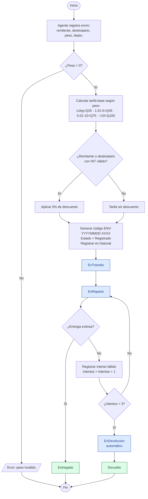
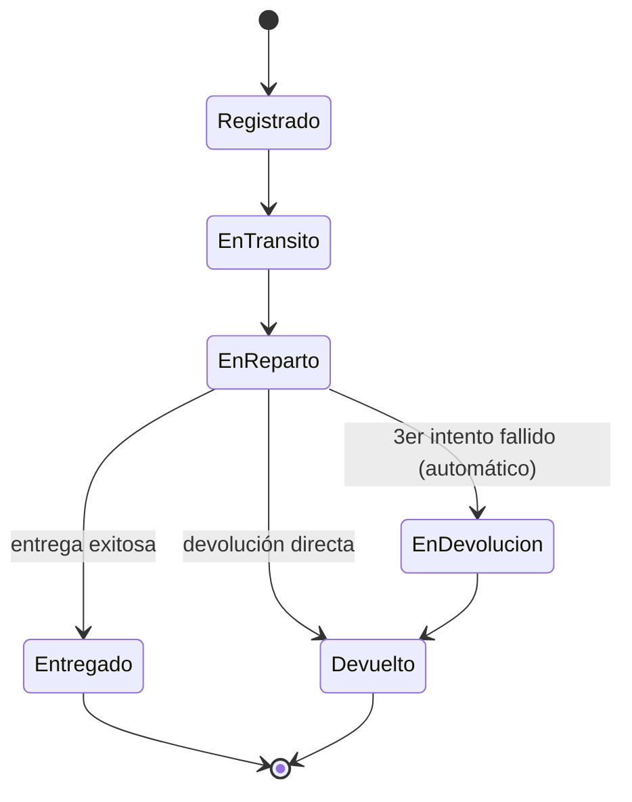

# Diagrama de Flujo — Proceso de un Envío

Diagrama del proceso completo, desde el registro hasta un estado final
(`Entregado` o `Devuelto`), incluyendo el cálculo de tarifa, el descuento por
NIT y la regla de los 3 intentos de entrega.

> GitHub renderiza Mermaid automáticamente. Para una imagen, pegar el bloque en
> https://mermaid.live

## Diagrama de Estados (Regla 3)

Refuerza que los estados solo avanzan en una dirección.

