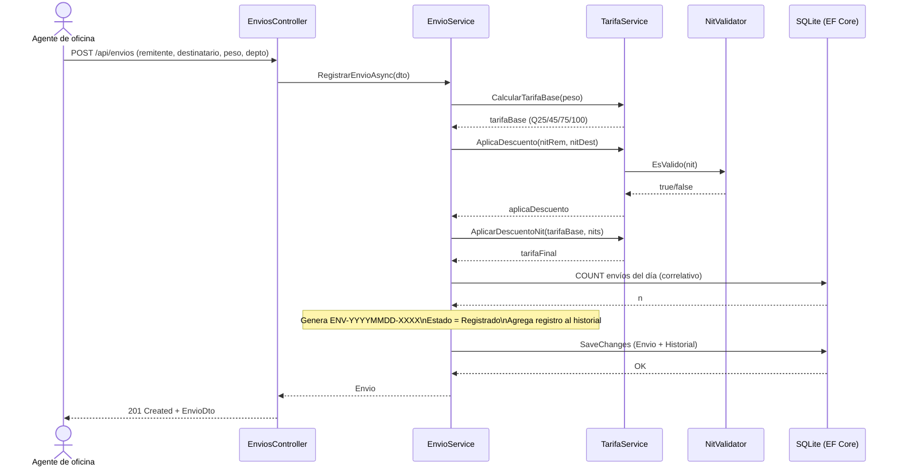

# Diagrama de Secuencia

Criterio de rúbrica: **Diagrama de secuencia (5 pts) — exactitud y coherencia.**

## Secuencia: Registrar un envío

Muestra la interacción entre el cliente HTTP, el controlador, los servicios de
negocio y la base de datos al registrar un envío, incluyendo el cálculo de la
tarifa, el descuento por NIT y la generación del código de rastreo.

### Código fuente (Mermaid)

> GitHub renderiza Mermaid automáticamente. Para regenerar la imagen, pegar el
> bloque en https://mermaid.live

